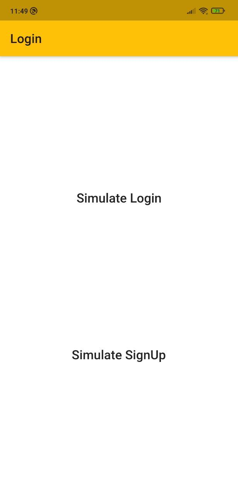
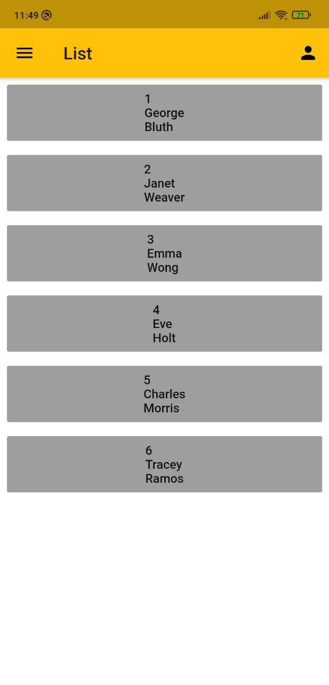
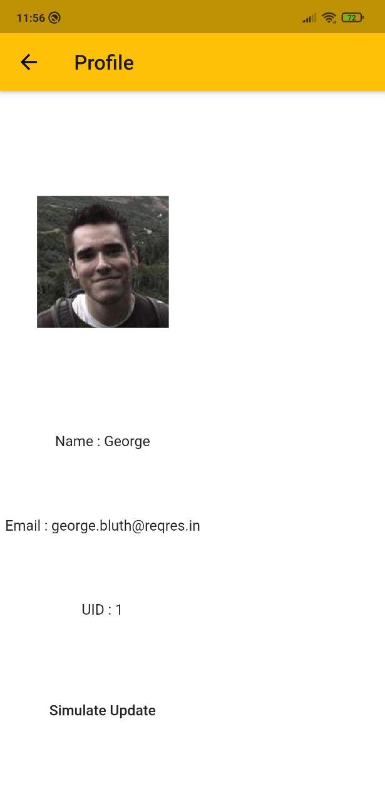
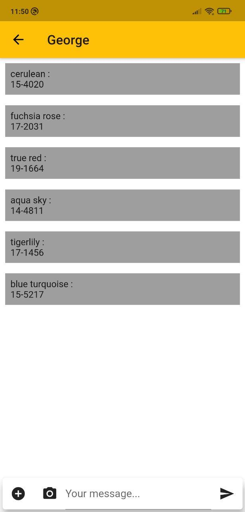
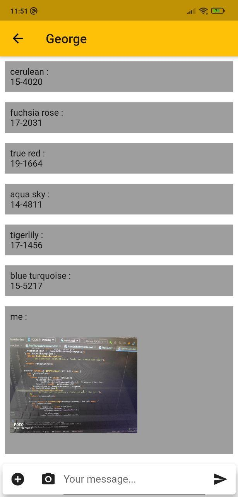
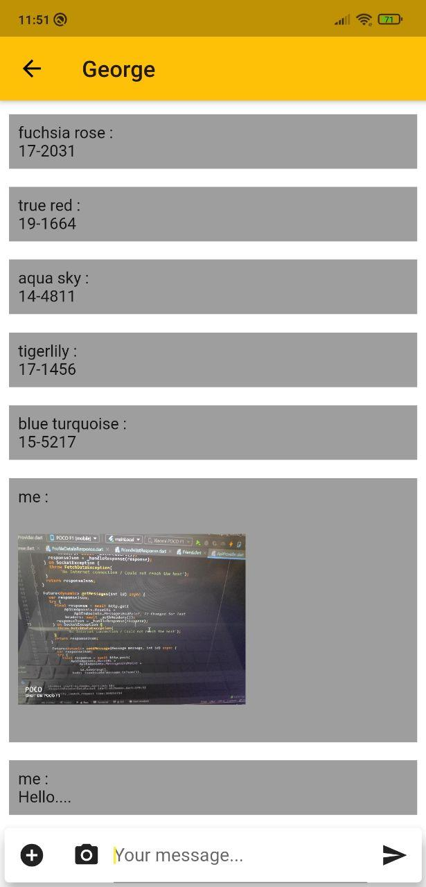

# MessagingApp as Template

This repo contains code of a messaging application (template) build with [Flutter](www.flutter.dev) with [Provider](https://github.com/rrousselGit/provider) and [ChangeNotifiers](https://api.flutter.dev/flutter/foundation/ChangeNotifier-class.html) for State Management.

## Code Structure
```
lib
├── Core                  # Everything other than UI
│   ├── ChangeNotifiers   # ChangeNotifiers for Provider
│   ├── Data              # Local Data (SharedPrefs, Database if any)
│   ├── Helpers           # Helper Classes
│   ├── Models            # Data Models
│   ├── Networking        # ApiProvider class for networking & ResponseModels.
│   ├── Repository        # Notifier to Network bridge.
├── UI                    # UI (widgets)
│   ├── Screens           # All Screens (Login, List, ChatRoom etc)
│   ├── Widgets           # Custom Widgets(MessageTiles etc)
├── main_local.dart       # Contains main method for Local URL and enabled debugprint()
├── main_prod.dart        # Contains main method for Production URL and disabled debugprint()
├── main_staging.dart     # Contains main method for Stage URL and enabled debugprint()
└── MyApp.dart            # Contains MyApp Widget with Material App
```

## Setup

Please Follow these steps:
  - Just change base urls and api end points in [ApiEndpoints.dart](https://github.com/iamSahdeep/MessagingAppTemplate/blob/master/lib/Core/Helpers/ApiEndpoints.dart)
  - Create a Entry point for your `main()` methods, if not found. Need help? Please refer to this [StackOverflow Question](https://stackoverflow.com/questions/55510244/flutter-how-do-i-change-main-dartentry-point-to-some-other-page-in-flutter) for any way run application.
  - Clear Data or Uninstall the application from device after changing the Development Environment, as it may cause certain issues while running.

## Assumptions
There are certain assumption taken while creating this, like API responses etc.
- ### API Responses format
    - Login/SignUp Response
      ```
      {"token" : "qwfg13fewqffsasd"}
      ```
    - Logout Response
      ```
      {"response" : "success"}
      ```
    - Profile Details Response
      ```
      {  
        "profile" : {
        "id": 2,
        "email": "janet.weaver@reqres.in",
        "name": "Janet",
        "avatar": "https://s3.amazonaws.com/uifaces/faces/twitter/josephstein/128.jpg"
        }
      }
      ```
    - Friends List Response
      ```
      {  
        "friends" : [
          {
            "friend_id": 2,
            "name": "Janet",
            "last_message": "Hey, how are you",
            "avatar": "https://s3.amazonaws.com/uifaces/faces/twitter/josephstein/128.jpg"
          }
        ]
      }
      ```
    - Chat Room Response
      ```
      {  
        "messages" : [
          {
            "name": "Janet",
            "text": "Hey, how are you?",
          }
        ]
      }
      ```

## WireFrame :


## Implemented Features/App Walkthrough 

- On first launch, after splash screen you should be redirected to Login Screen
  - There are two buttons on Login Screen, to simulate login and signup. You should be directed to FriendsList Screen in case of successful login or signup.
  - In case of unsuccessfull attempt to login/signup there will be a Snackbar with Exception message.
  - On reaching friend list you should see a circular loader to fetch friends list. on successfull attempt you will see list of friends with id, name and last message in tile.
  - In case of failed attmpt you will see error message in center of the screen. In case of exception of Unautherised request (unknown session/token), ther will be a button to reach login screen from it.
  - On clicking any friend in FriendList you will reach ChatRoom Screen. And messages will load.
  - On succesfull request you will see messages. Incase of image the images will be laoded and incase of text you will see text.
  - In case of unsuccefull request that thing will happend as happened in FriendList Screen.
  - You can send images and open camera and send message. We have assumed the post response will return list of updated messages. Although Post request is implmented but NOT handled. But you should see your sent text, image in the messages list.
  - on pull to Refresh in the list, messages will be updated but your messages will be removed as POST method is not yet handled.
  - In FriendList Screen there is Action on AppBar to reach Profile Screen, which will show only profile details, and simulate update button. on successfull update your details will be updated on screen, in case of error you will se snackbar.
  - On the same screen there is Drawer with options to switch to dark theme or light theme, which will dynamically change the theme. 
  - There is a button to logout in the AppDrawer to logout, in any case of failure or success of Delete Request, you will reach login screen.
  
## Test with some API
I have used reqres.in to mock API's with there endpoints.

To test that on your machience switch to [test_reqres](https://github.com/iamSahdeep/MessagingAppTemplate/tree/test_reqres) branch and just run app.
To look for changes for making it working look into this [commit](https://github.com/iamSahdeep/MessagingAppTemplate/commit/5e99c76b884c9b815558a00f50695f5130bc023f)
Here are some ugly screen shots :|

<p align="center">






</p>

## Author & support

This project is created by [Sahdeep Singh](https://github.com/iamSahdeep) but with lots of support and help.
>
> If my work helped you, don't forget to endorse me on [LinkedIn](https://www.linkedin.com/in/iamsahdeep/) to keep me motivated :)


